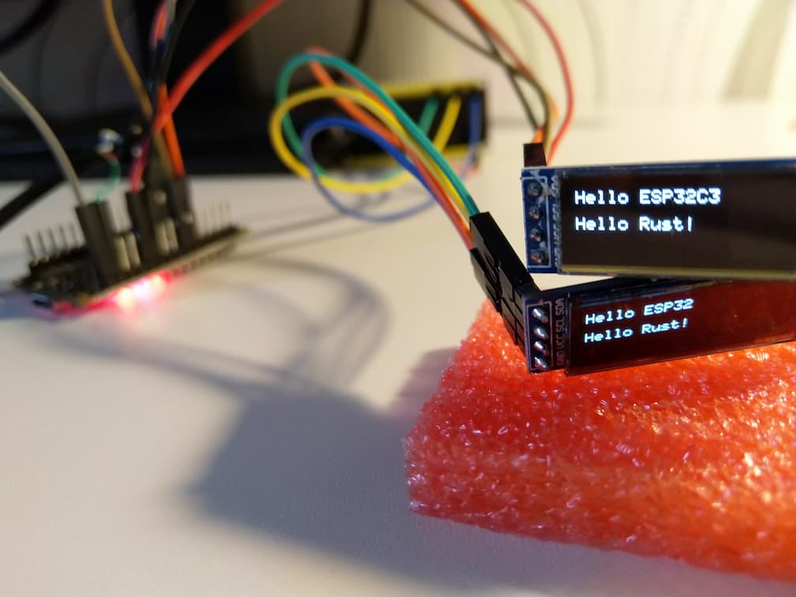

# Proof of Concept / Experiment: Use IDF-HAL-LL from BM Rust

- _idf-ll-compile_ pre-compiles a static library for ESP32C3 and ESP32
- _esp-ll_ a simple crate that uses the pre-compiled static libraries and implement OuputPin and I2c (only one)
- _esp32c3_ a BM Rust application that blinks LED on IO3 and drives an SSD1306 display
- _esp32_ a BM Rust application that drives an SSD1306 display

The code is very hacky since this is just an experiment.
